# School_District_Analysis

## Overview
This study analyzes an extensive data set from a hypothetical school district to spot trends and address concerns about math and literacy rates, comparing differences in spending per student, school size, and charter vs public schools.  After conducting a high-level overview of the school and district-level outcomes, the project specifically addresses concerns about data quality by removing the ninth-grader data at Thomas High School.  The effects of removing this population and replacing it with a null value on the school’s performance relative to other schools are then detailed.  

The study used pandas, a data analysis tool built on top of Python, to stardize the data contained within, merge data sets and present summary statistics.  

## Results

The names in the data set first had to be normalized.  I used the `str.replace` operator in Pandas to remove extraneous prefixes and suffixes from the names of students.  The updated student-level data set was merged with the school-level data set on the shared value “school name” shown here using pandas `merge` operator.  

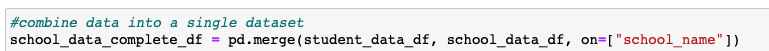

With a unified data set per-school averages can now be calculated to determine passing rates and compare schools by per-student funding, school size, and type of school shown here

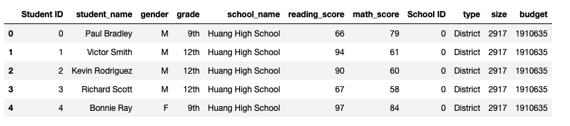

An allegation of widespread cheating by ninth graders at one of the high schools presents an opportunity to demonstrate using the `loc` operator in Pandas to index a portion of the data frame.  In practice, this means isolating a subset of the data - in this case ninth graders at Thomas High School - and replacing their test results with null values, and determining the effects on the school and district as a whole.  

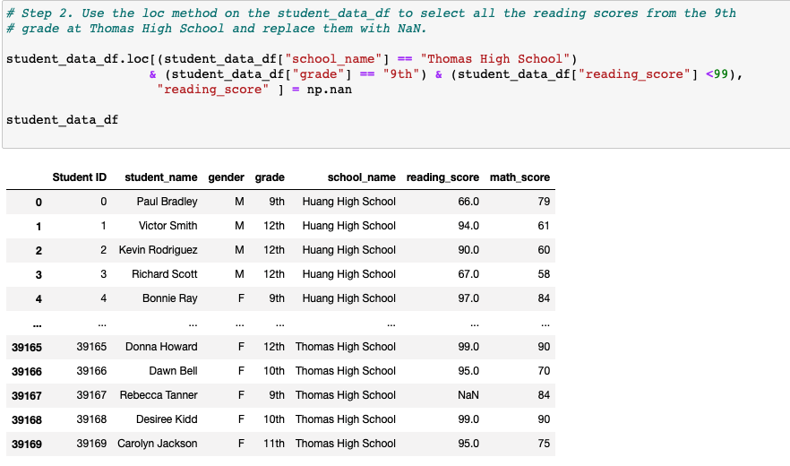

Removing this group of students had the following effects on math and reading scores, scores by school spending, size, and type:

### Change in the District Summary:

Removing the ninth graders from Thomas High School has a negligible effect on the district level as demonstrated by the following graphs:

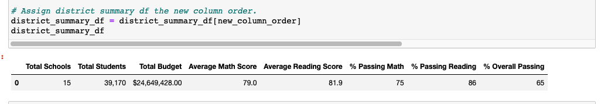
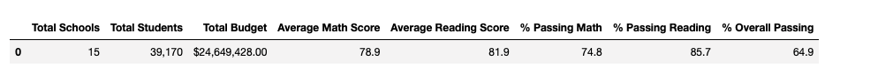

### Change in the School Summary:

We would expect a more pronounced change at the school level by removing the Ninth grade population. While the average scores did not change much, the overall passing percentage suffered a 25% decrease, pointing to a potential outlier in the ninth grade data:

### How Does This Change Affect Thomas High School Position Relative to Other Schools?

In the initial analysis Tomas High School ranked 2nd in overall passing rates.  

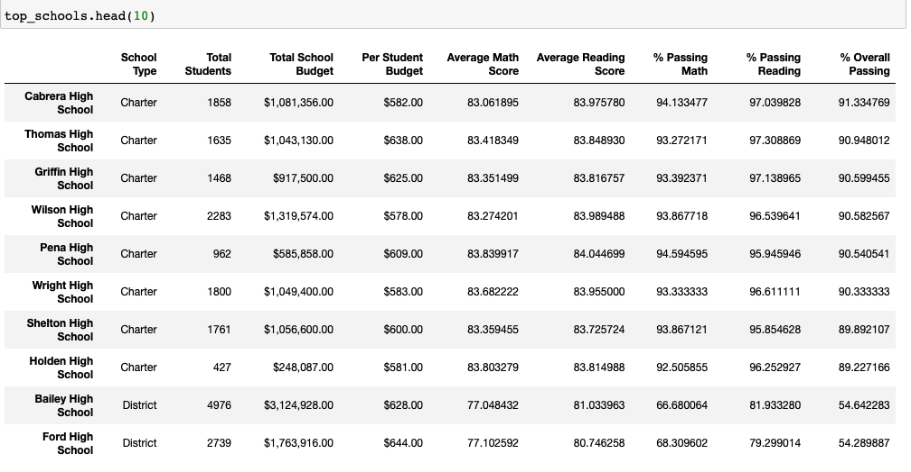

After adjusting for ninth grade data, however, Thomas High School plummets seven spots in the rankings to eighth overall - exactly in the middle of the pack.  

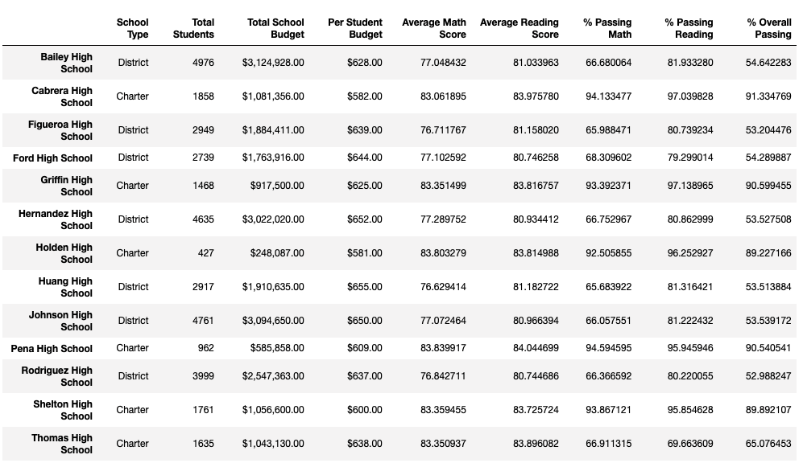

## Quick Statistics

### Adjusted Averages for Math and Reading scores:

The ninth grade data that was removed is shown here as ‘nan’, or ‘not a number’. 

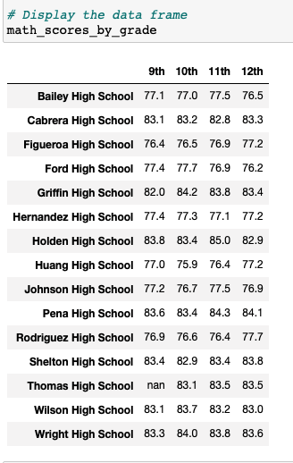 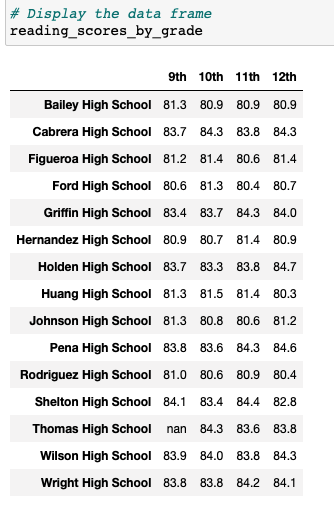

### Scores by school spending:
School’s were sorted by per student spending into three bins using the `cut` operator in pandas:

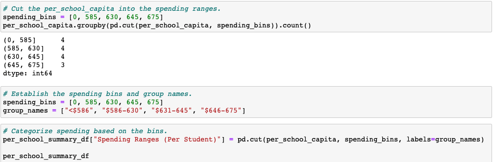

Using a dictionary in pandas, the various scores were added as columns to the spending ranges index:

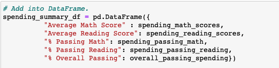

In line with previous analysis, removing the ninth grade population from Thomas High School has a negligible effect on the district level scores by spending ranges:

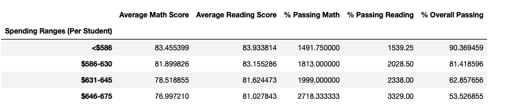

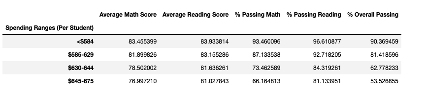

** A quick note here, you'll notice that the initial averages are wildly wrong.  The PyCitySchools_with_bugs.ipynb file is included in the repository to show where I tried unsuccesfuly to debug the errors. **

### Scores by school size:
The same approach was taken to sort schools into bins to represent small, medium and large sizes.  Here too, removing the ninth graders from Thomas High School has an almost imprtcentable change at the district-level.  

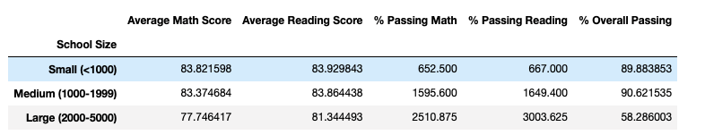
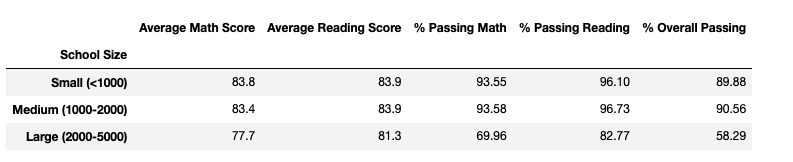

### Scores by school type:
Last, the schools were sorted by type, either charter or district school.  Here again we see almost no change from removing the ninth graders.  

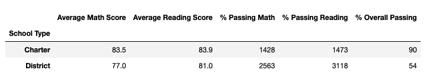
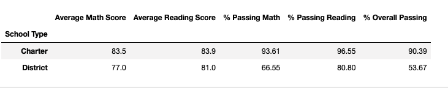

## Summary
An interesting question that emerges from the analysis is what factor(s) best explain variation in scores?  Is more funding correlated with higher scores, or small schools?  Do charter schools outcompete the more bureaucratic district types?  Removing the ninth grade population at a high achieving charter school offers an opportunity to explore four changes in the updated analysis:

- While charter schools seem to outcompete their district school peers, in fact this difference is better explained by school size, with large schools grossly underperforming.  The change in data at Thomas School does not alter this fact.  

- One would expect higher funding to correlate with higher test scores, but this is not the case.  In fact, charter schools with lower levels of per student finding are some of the highest performing schools.  Thomas High School is a charter school which complicates this narrative.  

- The overall passing rate for Thomas High School dropped from 91% to 65%.

- Thomas High School’s rank dropped from 2nd to 8th.

